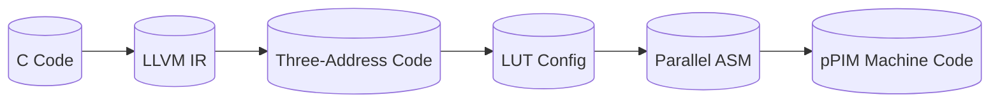
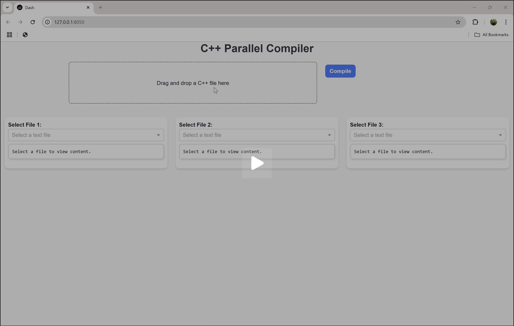

# **Parallel Matrix Multiplication Compiler for pPIM Architecture**  

## **🌐 Project Overview**  
This project automates the parallelization of matrix multiplication for **pPIM** (programmable Processing-in-Memory), a novel architecture that:  
- Embeds computation inside DRAM using **LUT-based cores** (4-bit inputs → 8-bit outputs).  
- Organizes cores into **clusters** (9 cores/cluster) for parallel MAC operations.  
- Reduces energy by **72%** compared to traditional CPUs by minimizing data movement.  

**Compiler Pipeline**:  


---

## **✨ Key Features**  
- **Automatic Parallelization**: Detects and maps parallelizable loops to pPIM clusters.  
- **Precision Scaling**: Splits 8-bit operations into 4-bit LUT-compatible tasks.  
- **Energy Efficiency**: Optimized for pPIM’s in-memory computing paradigm.  
- **Web Interface**: Drag-and-drop compilation.  

---

## **⚙️ Workflow**  
1. **Frontend**: C → LLVM IR (`clang -emit-llvm`).  
2. **Midend**: LLVM IR → Three-Address Code (TAC).  
3. **Backend**:  
   - Generates LUT configurations for pPIM cores.  
   - Produces parallel assembly (split across 9 cores/cluster).  
   - Outputs 24-bit pPIM machine code.  

---

## **📂 File Descriptions**  
| File | Purpose |  
|------|---------|  
| `matmul.cpp` | Input C code (naïve matrix multiplication). |  
| `extract_tac.py` | Converts LLVM IR → pPIM-compatible TAC. |  
| `create_lut.py` | Maps TAC operations to LUT cores. |  
| `generate_parallel.py` | Generates parallel assembly for pPIM clusters. |  
| `assembler.py` | Assembles ASM → 24-bit pPIM machine code. |  
| `app.py` | Web interface for compilation (Flask/Dash). |  

---

## **🛠️ Installation**  
### **Prerequisites**  
- Python 3.8+  
- LLVM/clang  
- `pip install dash flask dash-uploader llvmlite`  

### **Steps**  
```bash
git clone https://github.com/RakshaMiglani/Compilathon
cd Compilathon
pip install dash flask dash-uploader llvmlite
python app.py
```

---

## **🚀 Usage**  
### **Command Line**  
```bash
clang -S -emit-llvm -O1 matmul.cpp -o matmul.ll
python extract_tac.py matmul.ll > matmul.tac
python generate_parallel.py matmul.tac > matmul_parallel.asm
python assembler.py matmul_parallel.asm matmul_parallel.mc
```

---

## **🔮Preview** 
[](https://drive.google.com/file/d/1ZPCaUnSXMSeiZKOWxI2h3LZLJdlWi8SQ/view?usp=sharing)
